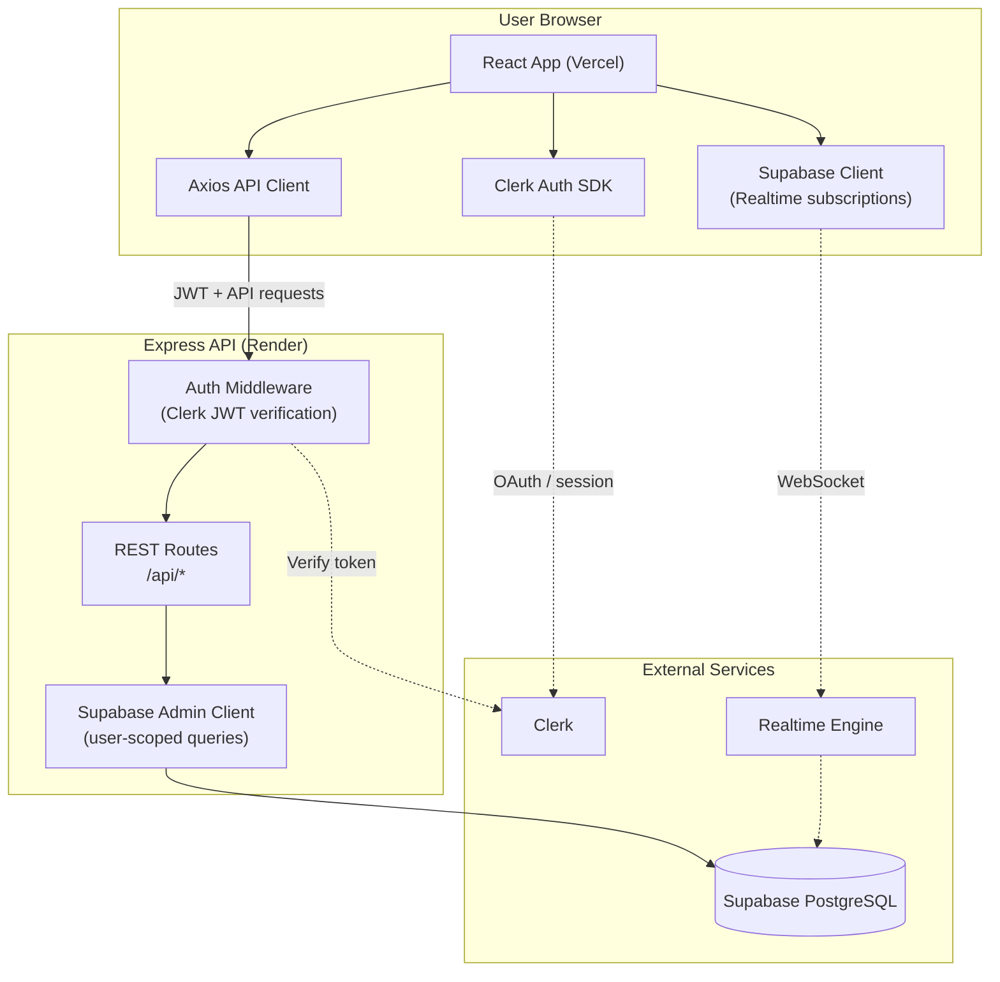
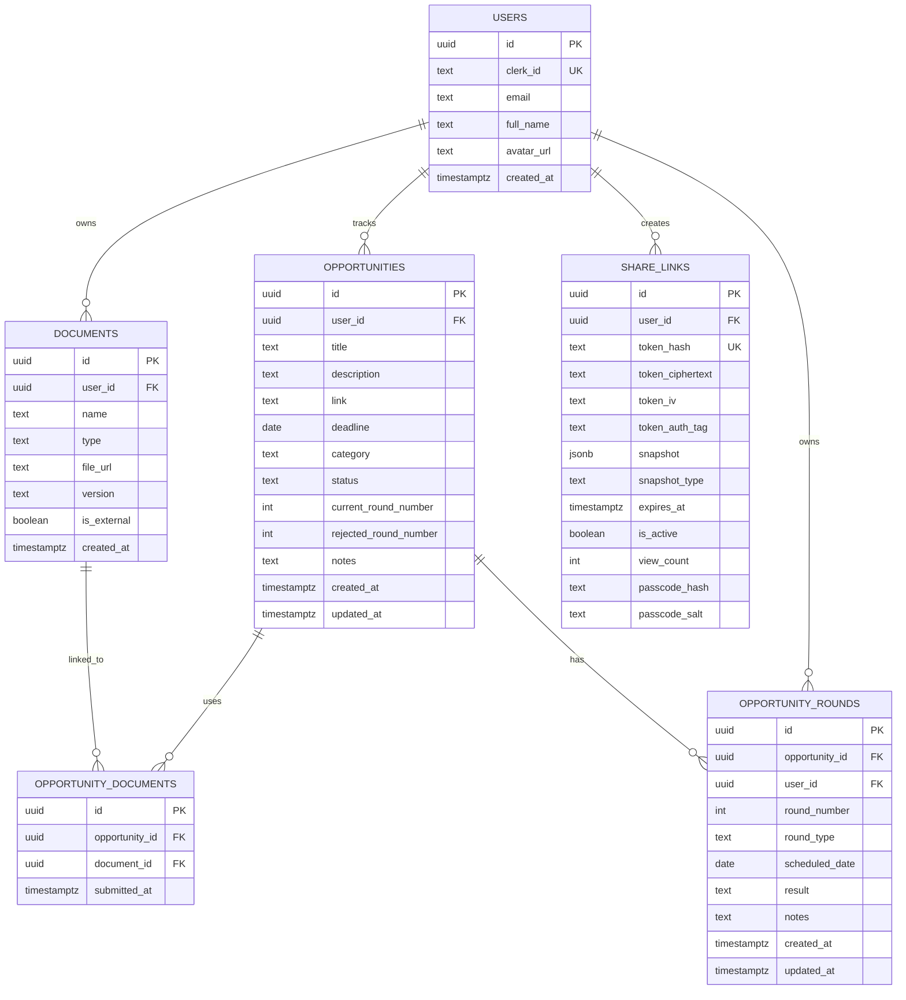
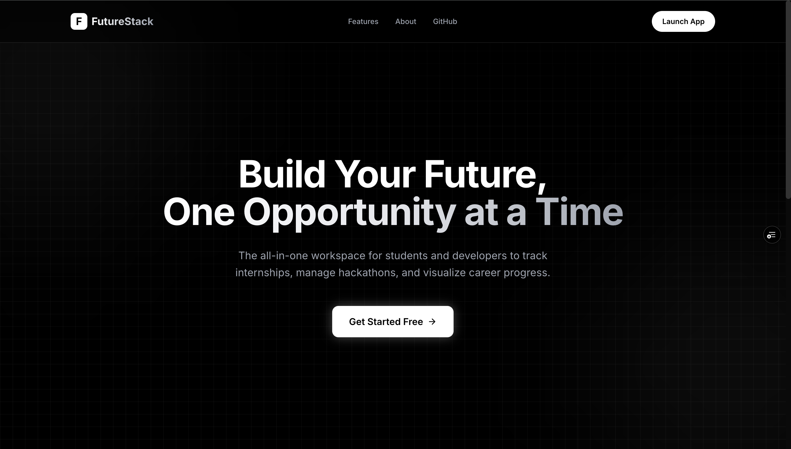
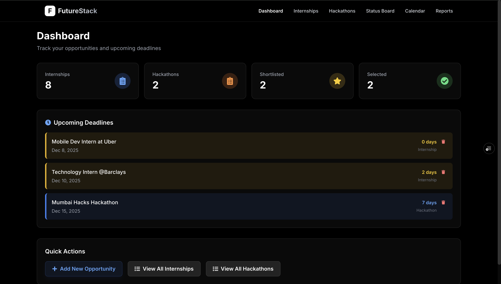
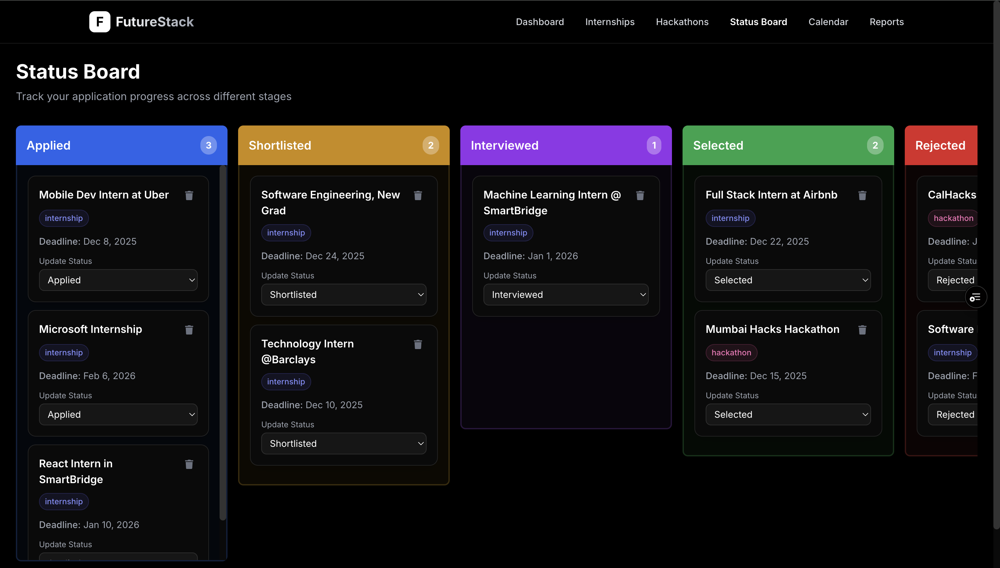
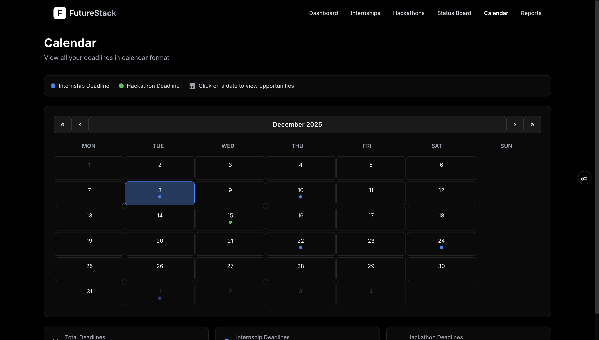
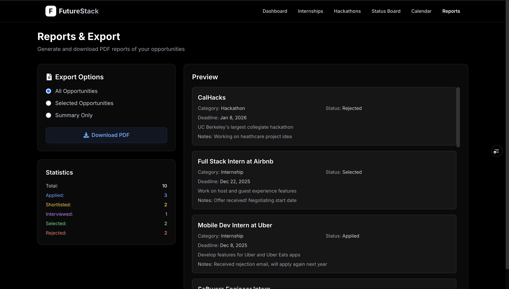

# FutureTracker 🚀

> Build Your Future, One Opportunity at a Time : 
> Your all-in-one opportunity tracker for internships, hackathons, and career growth

[](https://reactjs.org/)
[](https://tailwindcss.com/)
[](https://clerk.com/)
[](https://supabase.com/)
[](LICENSE)
[](https://futuretracker.online/)
[](https://stats.uptimerobot.com/ArICmEg95Y)
[](https://app.devin.ai/wiki/Venkat-Kolasani/FutureStack)

## 📋 Table of Contents

- [Overview](#overview)
- [Live Demo](#-live-demo)
- [Features](#features)
- [Tech Stack](#tech-stack)
- [System Architecture](#system-architecture)
- [Database Schema](#database-schema)
- [Getting Started](#getting-started)
- [Environment Variables](#environment-variables)
- [Deployment](#deployment)
- [Project Structure](#project-structure)
- [API Documentation](#api-documentation)
- [Screenshots](#screenshots)
- [Documentation](#-documentation)

## 🎯 Overview

FutureTracker is a modern, full-featured SaaS application designed to help students and professionals track their career opportunities. Whether you're applying for internships, participating in hackathons, or managing multiple job applications, FutureTracker provides an intuitive interface to organize, track, and manage all your opportunities in one place.

### Why FutureTracker?

- **🔐 Secure Authentication**: Sign in with Google, GitHub, or email via Clerk
- **⚡ Real-time Sync**: Instant updates across all devices via Supabase Realtime
- **📊 Visual Management**: Kanban-style status board for easy progress tracking
- **📈 Analytics Dashboard**: Track success rates, trends, and conversion funnels
- **📅 Deadline Management**: Never miss an important deadline with calendar integration
- **📄 PDF Reports**: Export detailed reports for your records
- **🔗 Share links**: Generate revocable read-only opportunity links with descriptions, deadlines, application CTAs, expiry, and optional passcode
- **🧠 Interview prep**: Per-internship workspace for company research, Q&A, technical topics, STAR behavioral answers, and reflections — see [`docs/interview-prep.md`](docs/interview-prep.md)
- **📊 ATS resume hints**: Client-side PDF/DOCX analysis with rule-based scoring on upload — see [`docs/documents-and-ats.md`](docs/documents-and-ats.md)
- **🤖 AI Resume Checker**: Agentic server-side pipeline (LLM-powered) that extracts a structured JSON Resume, enriches with GitHub signals, and scores across four categories with evidence — see [`docs/ai-resume-checker.md`](docs/ai-resume-checker.md)
- **🟢 Service status**: Live uptime page linked from the app footer and navbar
- **📱 Responsive Design**: Works seamlessly on desktop, tablet, and mobile

### Demonstration Videos

- [Website Demonstration Video](https://drive.google.com/file/d/1qL-gTfaE4hcs98NN6SgJ33D8HyKBz06t/view?usp=drive_link) – walk through the UI, navigation, and primary flows.
- [Code Demonstration Video](https://drive.google.com/file/d/1aIHa0MnmIom3yrpk1rDdPfCrVDMuheT7/view?usp=sharing) – review the repository layout, component architecture, and deployment steps.

## 🌐 Live Demo

**Frontend**: [https://futuretracker.online](https://futuretracker.online)  
**Backend API**: [https://futurestack-api.onrender.com](https://futurestack-api.onrender.com)  
**Service Status**: [UptimeRobot status page](https://stats.uptimerobot.com/ArICmEg95Y)

## ✨ Features

### Core Features

- **🔐 Authentication**: Secure OAuth login with Google, GitHub, and email (powered by Clerk)
- **📊 Dashboard**: Real-time statistics, analytics, and upcoming deadline tracking
- **➕ CRUD Operations**: Create, read, update, and delete opportunities
- **🔍 Search & Filter**: Quickly find opportunities by title, status, or category
- **📅 Calendar View**: Visual representation of all deadlines
- **📋 Status Board**: Kanban-style board with drag-and-drop status updates
- **📈 Analytics**: Charts for status distribution, weekly trends, conversion funnels, and deadline heatmaps
- **📄 PDF Export**: Generate professional reports with multiple export options
- **🔗 Opportunity sharing**: Share redacted, read-only opportunity details at `/share/:token` without requiring viewer sign-in
- **📎 Documents**: Upload resumes, cover letters, and portfolio links; track which documents were used for each internship; optional **ATS-style score** on PDF/DOCX upload; optional **AI Resume Check** via agentic LLM pipeline
- **🎯 Interview pipeline**: Multi-round tracking for internships (OA → technical → HR → final) with timeline UI and auto-synced Kanban status — see [`docs/interview-rounds.md`](docs/interview-rounds.md)
- **🧠 Interview preparation**: Tabbed prep workspace per internship (research, questions, topics, STAR behavioral, reflection) — see [`docs/interview-prep.md`](docs/interview-prep.md)
- **🎨 Modern UI**: Clean, dark-themed interface with smooth animations
- **📱 Responsive**: Fully responsive design for all screen sizes

### Technical Features

- **⚡ Real-time Updates**: WebSocket-powered instant sync via Supabase Realtime
- **🔄 JWT Authentication**: Secure API access with Clerk tokens
- **🛡️ Row-Level Security**: Data isolation at the database level
- **📦 Error Handling**: Comprehensive error handling with user-friendly messages
- **⏳ Loading States**: Skeleton loading indicators for premium UX
- **🔔 Toast Notifications**: Instant feedback for all actions
- **🎯 Auto-logout on 401**: Expired sessions handled gracefully

## 🛠 Tech Stack

### Frontend
| Technology | Version | Purpose |
|------------|---------|---------|
| React | 19.2.0 | UI library with hooks |
| React Router DOM | 7.9.6 | Client-side routing |
| Tailwind CSS | 3.4.18 | Utility-first CSS framework |
| Clerk React | 5.59.2 | Authentication SDK |
| Supabase JS | 2.89.0 | Realtime subscriptions |
| Recharts | 3.6.0 | Data visualizations |
| Framer Motion | 12.23.24 | Animations |
| React Calendar | 6.0.0 | Calendar component |
| jsPDF | 3.0.3 | PDF generation |
| mammoth | 1.12.0 | DOCX text extraction (ATS scorer) |
| pdfjs-dist | 6.0.227 | PDF text extraction (ATS scorer) |
| Axios | 1.13.2 | HTTP client |

### Backend
| Technology | Purpose |
|------------|---------|
| Node.js + Express | RESTful API server |
| Clerk SDK | JWT verification |
| Supabase Client | PostgreSQL database access |
| Vercel AI SDK (`ai`) | Provider-agnostic LLM layer (AI Resume Checker) |
| `@ai-sdk/google` | Google Gemini provider |
| `ollama-ai-provider` | Local Ollama / llama / qwen provider |
| `pdf-parse` + `mammoth` | Server-side PDF/DOCX text extraction |
| Zod | Structured LLM output validation |

### External Services
| Service | Purpose |
|---------|---------|
| **Clerk** | OAuth authentication (Google, GitHub, Email) |
| **Supabase** | PostgreSQL database + Realtime WebSockets |
| **Vercel** | Frontend hosting |
| **Render** | Backend hosting |
| **Google Gemini API** | LLM for AI Resume Checker (Ollama works offline) |
| **GitHub REST API** | Resume enrichment with public repo signals (optional) |

## 🏗 System Architecture



## 🗄 Database Schema



All tables use **Row-Level Security (RLS)** so each user only accesses their own data. Full SQL migrations live in [`docs/supabase-schema.sql`](docs/supabase-schema.sql) and the feature-specific files below.

| Migration file | Feature |
|----------------|---------|
| [`docs/supabase-schema.sql`](docs/supabase-schema.sql) | Core users + opportunities |
| [`docs/documents-migration.sql`](docs/documents-migration.sql) | Document vault + ATS columns |
| [`docs/opportunity-rounds-migration.sql`](docs/opportunity-rounds-migration.sql) | Interview round pipeline |
| [`docs/interview-prep-migration.sql`](docs/interview-prep-migration.sql) | Interview prep workspace |
| [`docs/hackathon-collaboration-migration.sql`](docs/hackathon-collaboration-migration.sql) | Hackathon teams, tasks, ideas |
| [`docs/share-links-migration.sql`](docs/share-links-migration.sql) | Dashboard share links |

## 🚀 Getting Started

### Prerequisites

- Node.js (v18 or higher)
- npm or yarn
- Clerk account ([clerk.com](https://clerk.com))
- Supabase account ([supabase.com](https://supabase.com))

### Installation

1. **Clone the repository**
   ```bash
   git clone https://github.com/Venkat-Kolasani/FutureStack.git
   cd FutureStack
   ```

2. **Install frontend dependencies**
   ```bash
   npm install
   ```

3. **Install backend dependencies**
   ```bash
   cd backend
   npm install
   cd ..
   ```

4. **Set up environment variables** (see [Environment Variables](#environment-variables))

5. **Start the backend**
   ```bash
   cd backend
   npm run dev
   ```

6. **Start the frontend** (in a new terminal)
   ```bash
   npm start
   ```

The app will open at `http://localhost:3000`

## 🔐 Environment Variables

### Frontend (`.env` in root)
```env
# Clerk Authentication
REACT_APP_CLERK_PUBLISHABLE_KEY=pk_test_...

# Backend API URL
REACT_APP_API_URL=http://localhost:3001/api
```

### Backend (`backend/.env`)
```env
# Server
PORT=3001
NODE_ENV=development

# CORS (Frontend URL)
CORS_ORIGIN=http://localhost:3000

# Clerk Authentication
CLERK_SECRET_KEY=sk_test_...

# Clerk JWT Public Key (recommended for production - see below)
# CLERK_JWT_PUBLIC_KEY=-----BEGIN PUBLIC KEY-----\nMIIB...\n-----END PUBLIC KEY-----

# Supabase Database
SUPABASE_URL=https://your-project.supabase.co
SUPABASE_SERVICE_ROLE_KEY=eyJ...
```

## 🚢 Deployment

### Frontend (Vercel)

1. Push your code to GitHub
2. Connect your repo to Vercel
3. Add environment variables:
   - `REACT_APP_CLERK_PUBLISHABLE_KEY`
   - `REACT_APP_API_URL` (your Render backend URL + `/api`)
4. Deploy

### Backend (Render)

1. Create a new Web Service on Render
2. Connect your GitHub repo, set root directory to `backend`
3. Add environment variables:
   - `NODE_ENV=production`
   - `CORS_ORIGIN` (your Vercel frontend URL)
   - `CLERK_SECRET_KEY`
   - `CLERK_JWT_PUBLIC_KEY` (recommended - see note below)
   - `SUPABASE_URL`
   - `SUPABASE_SERVICE_ROLE_KEY`
4. Deploy

#### CLERK_JWT_PUBLIC_KEY (Recommended for Production)

Setting `CLERK_JWT_PUBLIC_KEY` enables **local JWT verification** without network calls to Clerk's JWKS endpoint. This prevents `TypeError: fetch failed` errors that can occur on cloud platforms.

**To get the key:**
1. Go to [Clerk Dashboard](https://dashboard.clerk.com) > Configure > API Keys
2. Click "Show JWT Public Key"
3. Copy the entire PEM key

**Format:** If your hosting doesn't support multi-line env vars, replace newlines with `\n`:
```
-----BEGIN PUBLIC KEY-----\nMIIBIjANBgkq...\n-----END PUBLIC KEY-----
```

The middleware automatically normalizes both formats.

## 📁 Project Structure

```
futurestack/
├── public/                         # Static assets (incl. pdf.worker for ATS)
├── src/
│   ├── App.js                      # Routes, lazy loading, PostHog analytics
│   ├── components/
│   │   ├── auth/                   # ProtectedRoute
│   │   ├── common/                 # Navbar, Footer, StatusIndicator, Modal, …
│   │   ├── dashboard/              # StatsCard, DeadlineWidget
│   │   ├── opportunities/          # Cards, forms, detail modal (rounds + prep entry)
│   │   ├── rounds/                 # RoundTimeline, AddRoundModal
│   │   ├── interview-prep/         # Prep panels (questions, topics, STAR, …)
│   │   ├── documents/              # Upload, cards, ATS analysis UI
│   │   ├── hackathons/             # Team, ideas, tasks, checklist
│   │   ├── statusboard/            # Kanban columns + cards
│   │   ├── analytics/              # Rejection insights charts
│   │   └── seo/                    # react-helmet-async SEO component
│   ├── hooks/useAuthToken.js       # Clerk JWT → Axios interceptor
│   ├── lib/                        # supabase (realtime), analytics (PostHog)
│   ├── pages/                      # Route-level screens (see docs/CODEBASE_GUIDE.md)
│   ├── services/api.js             # All REST calls (opportunity, round, prep, …)
│   └── utils/                      # dateHelpers, pdfExport, atsScorer
├── backend/src/
│   ├── app.js                      # Express app, rate limits, route mounts
│   ├── middleware/auth.js          # Clerk JWT verification
│   ├── routes/
│   │   ├── opportunities.js        # Opportunities CRUD
│   │   ├── opportunity-rounds.js   # Nested interview rounds
│   │   ├── interview-prep.js       # Prep workspace API
│   │   ├── documents.js            # Document vault + upload
│   │   ├── hackathons.js           # Team collaboration
│   │   └── analytics.js            # Dashboard analytics
│   ├── validation/                 # Request schemas per domain
│   └── lib/                        # Supabase client, round sync helpers
├── docs/                           # Feature guides + SQL migrations
│   ├── CODEBASE_GUIDE.md           # Start here for code orientation
│   ├── interview-rounds.md
│   ├── interview-prep.md
│   ├── documents-and-ats.md
│   ├── DOCUMENTATION.md            # Full architecture deep-dive
│   └── TESTING.md
└── package.json
```

**Orientation:** [`docs/CODEBASE_GUIDE.md`](docs/CODEBASE_GUIDE.md) maps routes, services, and feature docs in one place.

## 🔌 API Documentation

### Base URL
- **Development**: `http://localhost:3001/api`
- **Production**: `https://futurestack-api.onrender.com/api`

### Authentication
All endpoints except `/health` require a valid Clerk JWT token:
```
Authorization: Bearer <clerk_jwt_token>
```

### Endpoints

| Method | Endpoint | Description | Auth |
|--------|----------|-------------|------|
| GET | `/health` | Health check | ❌ |
| GET | `/health/deps` | Supabase dependency check | ❌ |
| GET | `/me` | Current user info | ✅ |
| GET | `/opportunities` | List user's opportunities | ✅ |
| GET | `/opportunities/:id` | Get single opportunity | ✅ |
| POST | `/opportunities` | Create opportunity | ✅ |
| PATCH | `/opportunities/:id` | Update opportunity | ✅ |
| DELETE | `/opportunities/:id` | Delete opportunity | ✅ |
| GET | `/opportunities/:id/rounds` | List interview rounds (internships) | ✅ |
| POST | `/opportunities/:id/rounds` | Create round; returns `{ round, opportunity, rounds }` | ✅ |
| PATCH | `/opportunities/:id/rounds/:roundId` | Update round; returns synced payload | ✅ |
| DELETE | `/opportunities/:id/rounds/:roundId` | Delete round; returns synced payload | ✅ |
| GET | `/interview-prep/:opportunityId` | Get prep + questions + topics + behavioral | ✅ |
| POST | `/interview-prep/:opportunityId` | Create prep record | ✅ |
| PUT | `/interview-prep/:opportunityId` | Update research / reflection notes | ✅ |
| POST/PUT/DELETE | `/interview-prep/:opportunityId/questions|topics|behavioral/...` | Prep sub-resources | ✅ |
| GET | `/documents` | List documents | ✅ |
| POST | `/documents/upload` | Upload file (multipart) | ✅ |
| POST | `/documents/:id/assign` | Link document to opportunity | ✅ |
| GET | `/hackathons/:id/team` | Hackathon team workspace | ✅ |
| GET | `/analytics` | Dashboard analytics | ✅ |

Full route tables: [`backend/README.md`](backend/README.md), [`docs/interview-prep.md`](docs/interview-prep.md), [`docs/documents-and-ats.md`](docs/documents-and-ats.md).

### Example: Create Opportunity
```http
POST /api/opportunities
Authorization: Bearer <token>
Content-Type: application/json

{
  "title": "Software Engineer Intern",
  "description": "Full-stack development role",
  "link": "https://example.com/apply",
  "deadline": "2025-12-31",
  "category": "internship",
  "status": "applied",
  "notes": "Prepare portfolio"
}
```

## 📸 Screenshots

### Landing Page
Clean, modern landing page with animated hero section


### Dashboard
Real-time statistics with color-coded cards:
- **Internships** (Blue)
- **Hackathons** (Orange)
- **Shortlisted** (Yellow)
- **Selected** (Green)


### Status Board
Kanban-style board with 5 columns for visual progress tracking


### Calendar View
Interactive calendar with deadline visualization


### Reports
Flexible PDF export with multiple options


## 🎨 Design System

### Color Palette

- **Primary**: Blue (#3B82F6) - Internships, Primary actions
- **Secondary**: Orange (#F97316) - Hackathons
- **Success**: Green (#10B981) - Selected status
- **Warning**: Yellow (#F59E0B) - Shortlisted status
- **Danger**: Red (#EF4444) - Rejected status, Errors
- **Background**: Gray-900 (#111827) - Dark theme

### Typography

- **Font Family**: Inter, system-ui, sans-serif
- **Headings**: Bold, 2xl-3xl
- **Body**: Regular, sm-base
- **Labels**: Medium, sm

## 🤝 Contributing

FutureStack is part of **GSSoC 2026**. Please read [CONTRIBUTING.md](CONTRIBUTING.md) before requesting an issue assignment or opening a PR.

## 📚 Documentation

| Doc | Purpose |
|-----|---------|
| [**Codebase guide**](docs/CODEBASE_GUIDE.md) | **Start here** — routes, services, golden rules, recent PRs |
| [Devin Wiki](https://app.devin.ai/wiki/Venkat-Kolasani/FutureStack) | Canonical runbook, deployment, architecture decisions |
| [Interview rounds](docs/interview-rounds.md) | Multi-round pipeline, status sync, performance fix |
| [Interview prep](docs/interview-prep.md) | Prep workspace API, UI tabs, testing |
| [Documents & ATS](docs/documents-and-ats.md) | Document vault + client-side ATS scorer |
| [DOCUMENTATION.md](docs/DOCUMENTATION.md) | Full architecture, auth flow, technical challenges |
| [TESTING.md](docs/TESTING.md) | CI commands, smoke checklist, per-feature tests |
| [CONTRIBUTING.md](CONTRIBUTING.md) | GSSoC workflow, PR rules |
| [SECURITY.md](docs/SECURITY.md) | Security practices and review notes |

---

**Built with ❤️ by [Venkat Kolasani](https://github.com/Venkat-Kolasani)**
