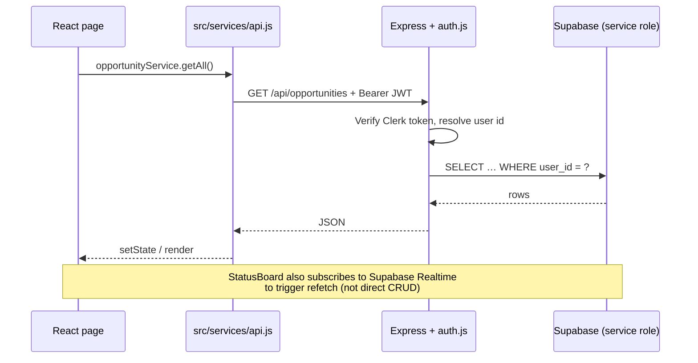

# Codebase Guide

Quick orientation for contributors, reviewers, and technical interviews. Read this before diving into individual feature docs.

## What is FutureTracker?

A full-stack React + Express app that helps students track internships and hackathons: Kanban status board, analytics, documents, multi-round interview pipelines, per-internship prep workspaces, and hackathon team collaboration.

| Environment | URL |
|-------------|-----|
| Frontend | [futuretracker.online](https://futuretracker.online) |
| Backend API | [futurestack-api.onrender.com/api](https://futurestack-api.onrender.com/api) |
| Service status | [UptimeRobot](https://stats.uptimerobot.com/ArICmEg95Y) |

---

## Repository layout

```
FutureStack/
├── src/                          # React frontend (Create React App)
│   ├── App.js                    # Routes, lazy loading, analytics
│   ├── pages/                    # One file per route (see table below)
│   ├── components/               # UI by domain (common, opportunities, interview-prep, …)
│   ├── services/api.js           # Axios client + all API service objects
│   ├── hooks/useAuthToken.js     # Registers Clerk JWT getter for API
│   ├── lib/supabase.js           # Realtime client ONLY (not CRUD)
│   └── utils/                    # Pure helpers (dates, PDF export, ATS scorer)
├── backend/
│   └── src/
│       ├── app.js                # Express app, middleware, route mounting
│       ├── middleware/auth.js    # Clerk JWT → internal user id
│       ├── routes/               # REST handlers per domain
│       ├── validation/           # Zod/Joi-style request schemas
│       └── lib/                  # Supabase admin client, sync helpers
├── docs/                         # Feature guides, migrations, testing
└── scripts/                      # architecture-check, verify-rounds-schema
```

---

## Golden rules

1. **All data through the API** — Frontend must not call `supabase.from()` except realtime in `StatusBoard.jsx`. Enforced by `npm run check:architecture`.
2. **Auth on every protected route** — `requireAuth` middleware; handlers use `req.auth.internalUserId`.
3. **Internship-only features** — Interview rounds and interview prep reject non-internship opportunities server-side.
4. **Migrations in `docs/`** — SQL files are the source of truth; run manually in Supabase.
5. **Tests for backend routes** — Changes under `backend/src/routes/` need tests in `backend/tests/`.

---

## Request flow (mental model)



---

## Frontend routes

| Path | Page | Auth | Notes |
|------|------|------|-------|
| `/` | `Home.jsx` | Public | Landing + footer status link |
| `/share/:token` | `PublicSharePage.jsx` | Public | Read-only redacted opportunity share, optional passcode |
| `/dashboard` | `Dashboard.jsx` | ✅ | Stats, deadlines |
| `/internships` | `InternshipList.jsx` | ✅ | Detail drawer → rounds + prep |
| `/internships/:id/prep` | `InterviewPrepDetail.jsx` | ✅ | Interview prep workspace |
| `/hackathons` | `HackathonList.jsx` | ✅ | |
| `/hackathons/:id` | `HackathonDetail.jsx` | ✅ | Team, ideas, tasks, checklist |
| `/status-board` | `StatusBoard.jsx` | ✅ | Kanban + realtime |
| `/calendar` | `Calendar.jsx` | ✅ | |
| `/documents` | `Documents.jsx` | ✅ | Upload + ATS analysis |
| `/analytics` | `Analytics.jsx` | ✅ | Charts + rejection insights |
| `/reports` | `Reports.jsx` | ✅ | PDF export |
| `/add`, `/edit/:id` | Add/Edit opportunity | ✅ | |

---

## Backend route modules

| Mount path | File | Domain |
|------------|------|--------|
| `/api/opportunities` | `routes/opportunities.js` | CRUD + nested rounds |
| `/api/analytics` | `routes/analytics.js` | Dashboard stats |
| `/api/documents` | `routes/documents.js` | Vault + assign + ATS fields |
| `/api/hackathons` | `routes/hackathons.js` | Team collaboration |
| `/api/interview-prep` | `routes/interview-prep.js` | Prep workspace |
| `/api/share-links` | `routes/share-links.js` | Authenticated share create/list/revoke |
| `/api/public/share-links` | `routes/public-share-links.js` | Public token/passcode read-only shares |
| `/api/health` | `app.js` | Liveness |
| `/api/health/deps` | `app.js` | Supabase reachability |

Round-specific logic also lives in `routes/opportunity-rounds.js` (mounted from opportunities router) and `lib/syncOpportunityFromRounds.js`.

The AI resume check pipeline lives in `lib/resume-agent/` (extract → parse → github → evaluate)
and the provider-agnostic LLM layer in `lib/llm/`. See [`ai-resume-checker.md`](ai-resume-checker.md).

---

## API service objects (`src/services/api.js`)

| Export | Backend prefix |
|--------|----------------|
| `opportunityService` | `/opportunities` |
| `roundService` | `/opportunities/:id/rounds` |
| `documentService` | `/documents` |
|| `resumeCheckerService` | `/documents/:id/ai-check` |
| `hackathonService` | `/hackathons/:id/...` |
| `interviewPrepService` | `/interview-prep/:opportunityId` |
| `analyticsService` | `/analytics` |
| `shareLinkService` | `/share-links`, `/public/share-links` |

Always add new endpoints here — pages should not construct URLs manually.

---

## Feature → doc map

| Feature | Deep-dive doc | Migration SQL |
|---------|---------------|---------------|
| Interview rounds | [`interview-rounds.md`](interview-rounds.md) | `opportunity-rounds-migration.sql` |
| Interview prep | [`interview-prep.md`](interview-prep.md) | `interview-prep-migration.sql` |
| Documents + ATS | [`documents-and-ats.md`](documents-and-ats.md) | `documents-migration.sql` |
|| AI Resume Checker | [`ai-resume-checker.md`](ai-resume-checker.md) | `ai-resume-check-migration.sql` |
| Dashboard share links | [`share-links.md`](share-links.md) | `share-links-migration.sql`, `supabase/migrations/20260624163000_create_share_links.sql`, `supabase/migrations/20260624171000_add_recoverable_share_tokens.sql` |
| Hackathon collaboration | [`DOCUMENTATION.md`](DOCUMENTATION.md#hackathon-team-collaboration-new) | `hackathon-collaboration-migration.sql` |
| Architecture & challenges | [`DOCUMENTATION.md`](DOCUMENTATION.md) | `supabase-schema.sql` |
| Testing & CI | [`TESTING.md`](TESTING.md) | — |
| Security | [`SECURITY.md`](SECURITY.md) | — |

---

## Recent merged work (2026)

| PR | Summary |
|----|---------|
| **AI Checker** | Agentic AI resume check pipeline (LLM extract → parse → GitHub → evaluate); MIT attribution to interviewstreet/hiring-agent |
|| **#60** | Client-side ATS resume scorer on document upload |
| **#58** | Interview preparation module (questions, topics, STAR, reflection) |
| **#56** | Interview rounds UI (timeline, modal, Kanban sync) |
| **#29** | CI, tests, architecture guardrails |
| **#15** | Auth race condition + false session-expired redirects |
| *(main)* | UptimeRobot status indicator in UI + README |

When explaining the project in an interview, lead with **realtime Kanban + RLS challenge**, then **round save latency fix**, then **interview prep** or **ATS scorer** depending on the role.

---

## Local development (minimal)

```bash
# Terminal 1
cd backend && npm run dev    # :3001

# Terminal 2
npm start                    # :3000
```

Env files: `.env` (frontend), `backend/.env` (API). See README **Environment Variables**.

Before a PR:

```bash
npm run test:ci && npm run build
cd backend && npm test && cd ..
npm run check:architecture
```

Full checklist: [`TESTING.md`](TESTING.md).

---

## Where to start for common tasks

| Task | Start here |
|------|------------|
| Fix internship drawer | `OpportunityDetailModal.jsx`, `roundService` |
| Add prep field | `interview-prep-migration.sql` → `interview-prep-schemas.js` → route → panel component |
| New API endpoint | `backend/src/routes/` + test + `api.js` service method |
| UI-only change | `src/components/` or `src/pages/` + smoke test |
| DB column | New `docs/*-migration.sql` + backend validation + frontend types |

---

## External wiki

[Devin Wiki](https://app.devin.ai/wiki/Venkat-Kolasani/FutureStack) — maintained runbook with deployment notes and architecture decisions. Use local `docs/` for offline and version-controlled detail.
