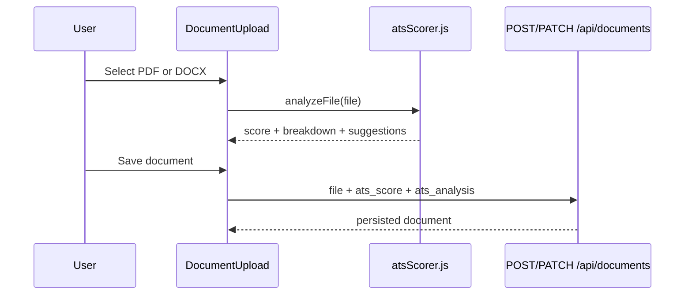

# Documents Vault & ATS Scorer

> **Interview talking point:** Client-side resume analysis — extract text from PDF/DOCX in the browser, score structure and content with rule-based heuristics, persist results on the document record via the API.

## Documents vault

Users upload and manage resumes, cover letters, and portfolio links. Documents can be **assigned** to specific internship opportunities to track which materials were used for each application.

### Database

See [`documents-migration.sql`](documents-migration.sql):

| Table | Purpose |
|-------|---------|
| `documents` | User-owned files and external links |
| `opportunity_documents` | Many-to-many link between opportunities and documents |

ATS-related columns on `documents`:

| Column | Type | Purpose |
|--------|------|---------|
| `ats_score` | `INTEGER` | Total score 0–100 from client analysis |
| `ats_analyzed_at` | `TIMESTAMPTZ` | Last analysis timestamp |
| `ats_analysis` | `JSONB` | Full breakdown (sections, suggestions, keyword hints) |

### API (`/api/documents`)

| Method | Endpoint | Description |
|--------|----------|-------------|
| GET | `/` | List user's documents |
| GET | `/:id` | Single document |
| GET | `/by-opportunity/:opportunityId` | Documents linked to an opportunity |
| POST | `/` | Create document (metadata / external URL) |
| POST | `/upload` | Multipart file upload |
| PATCH | `/:id` | Update metadata; can include `ats_score`, `ats_analysis` |
| DELETE | `/:id` | Delete document |
| POST | `/:id/assign` | Link document to opportunity |
| DELETE | `/:id/unassign/:opportunityId` | Remove link |

Frontend service: `documentService` in `src/services/api.js`.

### UI

```
src/
├── pages/Documents.jsx
└── components/documents/
    ├── DocumentUpload.jsx      # Upload + ATS analysis on save
    ├── DocumentCard.jsx        # Shows ATS score badge and breakdown
    └── DocumentSelector.jsx    # Pick documents when applying
```

---

## ATS scorer (client-side)

**PR #60** added rule-based ATS-style feedback. This is **not** a third-party ATS integration — analysis runs entirely in the browser.

### Module

`src/utils/atsScorer.js`

| Export | Purpose |
|--------|---------|
| `analyzeText(text)` | Score plain text; returns `{ total, breakdown, suggestions, suggestedKeywords }` |
| `analyzeFile(file)` | Extract text from PDF (pdf.js) or DOCX (mammoth), then call `analyzeText` |

### Scoring model (v1)

| Category | Max points | What it checks |
|----------|------------|----------------|
| **Structure** | 60 | Presence of Contact, Education, Skills, Experience, Projects sections (regex heuristics) |
| **Content** | 25 | Skills depth, project mentions, experience bullet density |
| **ATS-friendly** | 15 | Length (~400–1000 words), email, LinkedIn/GitHub links |

Keywords (`KEYWORDS` array) are **suggested** to the user but do **not** change the numeric score in v1.

### Flow



Analysis happens **before** upload. The server stores the client-computed score; it does not re-run analysis.

### Dependencies

- `mammoth` — DOCX → text
- `pdfjs-dist` — PDF text extraction (`public/pdf.worker.min.js`)

### Tests

```bash
npm test -- atsScorer
```

Unit tests: `src/utils/__tests__/atsScorer.test.js`.

### UX disclaimer

UI shows: *"Rule-based hints — not an official ATS score."* Keep this when extending the feature.

---

## Setup checklist

1. Run `docs/documents-migration.sql` in Supabase (includes ATS columns if upgrading)
2. Ensure backend `documents` route is mounted (`backend/src/app.js`)
3. For PDF upload in dev, confirm `pdf.worker.min.js` is served from `public/`

---

## Interview one-liner

> "ATS scoring is intentionally client-side: we extract resume text with pdf.js and mammoth, apply transparent heuristics for section structure and content depth, then persist the breakdown on the document via our existing documents API — no external ML service, fast feedback for users."
