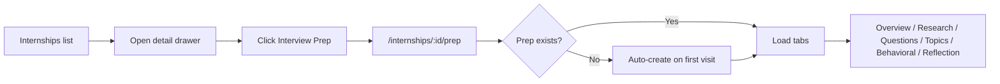

# Interview Preparation Module

> **Interview talking point:** Per-internship prep workspace — company research, question bank, technical topics, STAR behavioral answers, and reflection notes — with a tabbed UI, progress bar, and REST API backed by four normalized Supabase tables.

## Problem

Tracking **which company** you are interviewing with is not enough. Students need a dedicated place to:

- Capture **company research** before the interview
- Maintain a **question bank** with prepared answers
- Prioritize **technical topics** to review
- Draft **behavioral (STAR)** responses
- Write **post-interview reflections**

Interview **round tracking** (`opportunity_rounds`) answers *where you are in the pipeline*; interview prep answers *how you prepare for each internship*.

## Solution overview

| Layer | What we built |
|-------|----------------|
| **Database** | `interview_prep`, `interview_questions`, `technical_topics`, `behavioral_prep` — see [`interview-prep-migration.sql`](interview-prep-migration.sql) |
| **Backend** | `/api/interview-prep/*` routes with Zod validation and internship-only guards |
| **Frontend** | `InterviewPrepDetail` page + six panel components under `src/components/interview-prep/` |
| **Entry point** | Internship detail drawer → **Interview Prep** → `/internships/:id/prep` |

**Scope:** internships only (`category === 'internship'`). Hackathons use the collaboration workspace instead.

**Architecture rule:** all prep reads/writes go through Express (`interviewPrepService` in `src/services/api.js`). No `supabase.from()` for prep data in the frontend.

---

## User flow



### Tabs

| Tab | Component | Purpose |
|-----|-----------|---------|
| Overview | Built into `InterviewPrepDetail.jsx` | Internship summary, deadline, link, progress bar |
| Company Research | `CompanyResearchPanel.jsx` | Free-form research notes (`company_research`) |
| Questions | `InterviewQuestionsPanel.jsx` | Q&A list with `is_prepared` checkbox |
| Topics | `TechnicalTopicsPanel.jsx` | Study topics with priority (`low` / `medium` / `high`) and `is_reviewed` |
| Behavioral | `BehavioralPrepPanel.jsx` | STAR fields: Situation, Task, Action, Result |
| Reflection | `ReflectionPanel.jsx` | Post-interview notes (`reflection_notes`) |

`PrepProgressBar.jsx` aggregates completion across questions, topics, and behavioral entries.

---

## Database schema

```mermaid
erDiagram
    OPPORTUNITIES ||--o| INTERVIEW_PREP : has
    INTERVIEW_PREP ||--o{ INTERVIEW_QUESTIONS : contains
    INTERVIEW_PREP ||--o{ TECHNICAL_TOPICS : contains
    INTERVIEW_PREP ||--o{ BEHAVIORAL_PREP : contains

    INTERVIEW_PREP {
        uuid id PK
        uuid opportunity_id FK UK
        uuid user_id FK
        text company_research
        text reflection_notes
    }

    INTERVIEW_QUESTIONS {
        uuid id PK
        uuid prep_id FK
        text question
        text answer
        boolean is_prepared
    }

    TECHNICAL_TOPICS {
        uuid id PK
        uuid prep_id FK
        text topic
        text priority
        boolean is_reviewed
    }

    BEHAVIORAL_PREP {
        uuid id PK
        uuid prep_id FK
        text question
        text situation
        text task
        text action
        text result
    }
```

One `interview_prep` row per internship (`opportunity_id` is UNIQUE). All child tables cascade on delete.

### Setup

Run in Supabase SQL Editor:

```bash
# Paste contents of:
docs/interview-prep-migration.sql
```

If tables are missing, `GET /api/interview-prep/:opportunityId` returns **503** with `code: "TABLES_NOT_EXIST"`.

---

## API

Base path: `/api/interview-prep` (auth required).

### Main prep record

| Method | Endpoint | Description |
|--------|----------|-------------|
| GET | `/:opportunityId` | Returns `{ prep, questions, topics, behavioral }` (empty arrays if no prep yet) |
| POST | `/:opportunityId` | Create prep; body: `{ company_research?, reflection_notes? }` |
| PUT | `/:opportunityId` | Update `company_research` and/or `reflection_notes` |

### Interview questions

| Method | Endpoint | Body fields |
|--------|----------|-------------|
| POST | `/:opportunityId/questions` | `question`, `answer?`, `is_prepared?` |
| PUT | `/:opportunityId/questions/:questionId` | `question?`, `answer?`, `is_prepared?` |
| DELETE | `/:opportunityId/questions/:questionId` | — |

### Technical topics

| Method | Endpoint | Body fields |
|--------|----------|-------------|
| POST | `/:opportunityId/topics` | `topic`, `priority?` (`low` \| `medium` \| `high`), `is_reviewed?` |
| PUT | `/:opportunityId/topics/:topicId` | `topic?`, `priority?`, `is_reviewed?` |
| DELETE | `/:opportunityId/topics/:topicId` | — |

### Behavioral prep (STAR)

| Method | Endpoint | Body fields |
|--------|----------|-------------|
| POST | `/:opportunityId/behavioral` | `question`, `situation?`, `task?`, `action?`, `result?` |
| PUT | `/:opportunityId/behavioral/:behavioralId` | same fields, all optional |
| DELETE | `/:opportunityId/behavioral/:behavioralId` | — |

Validation schemas live in `backend/src/validation/interview-prep-schemas.js`. Integration tests: `backend/tests/integration/interview-prep.test.js`.

---

## Frontend file map

```
src/
├── pages/InterviewPrepDetail.jsx       # Route: /internships/:id/prep
├── components/interview-prep/
│   ├── PrepProgressBar.jsx
│   ├── CompanyResearchPanel.jsx
│   ├── InterviewQuestionsPanel.jsx
│   ├── TechnicalTopicsPanel.jsx
│   ├── BehavioralPrepPanel.jsx
│   └── ReflectionPanel.jsx
├── components/opportunities/
│   └── OpportunityDetailModal.jsx      # "Interview Prep" button (internships only)
└── services/api.js                     # interviewPrepService
```

### Loading pattern

`InterviewPrepDetail` on mount:

1. `opportunityService.getById(id)` — verify `category === 'internship'`
2. `interviewPrepService.getPrep(id)` — single GET returns all related data
3. If `prep` is null, `createPrep` on first interaction or auto-create flow

Child panels call `interviewPrepService` mutations and update local React state optimistically or after response.

---

## Relationship to interview rounds

| Feature | Table / route | Answers |
|---------|---------------|---------|
| **Interview rounds** | `opportunity_rounds`, `/api/opportunities/:id/rounds` | Which round are you in? Cleared / pending / rejected? |
| **Interview prep** | `interview_prep` + children, `/api/interview-prep/:id` | What are you studying? What will you say? |

Use both together: rounds for pipeline status on the Kanban board; prep for study materials per company.

Full rounds guide: [`interview-rounds.md`](interview-rounds.md).

---

## Testing

### Automated

```bash
cd backend && npm test -- interview-prep
```

### Manual smoke

1. Sign in → **Internships** → open an internship detail drawer
2. Click **Interview Prep** → confirm route `/internships/<id>/prep`
3. **Company Research** — save notes; refresh page; notes persist
4. **Questions** — add a question, mark prepared; check progress bar
5. **Topics** — add topic with high priority; toggle reviewed
6. **Behavioral** — add STAR entry with all four fields
7. **Reflection** — save reflection notes
8. Open a **hackathon** detail — confirm there is **no** Interview Prep button

### Common errors

| Symptom | Likely cause | Fix |
|---------|--------------|-----|
| 503 `TABLES_NOT_EXIST` | Migration not run | Run `docs/interview-prep-migration.sql` |
| 404 on prep routes | Opportunity is not an internship | Use an internship opportunity |
| Empty prep after create | Check network tab for POST errors | Ensure prep POST succeeds before adding questions |

---

## Merged in

- **PR #58** — `feat: add interview preparation module for internships` (June 2026)

---

## Interview one-liner

> "We added a per-internship prep workspace with normalized tables for questions, technical topics, and STAR behavioral answers. The API returns the full graph in one GET, the UI is tabbed with a progress bar, and everything goes through Express with internship-only authorization — same pattern as interview rounds."
